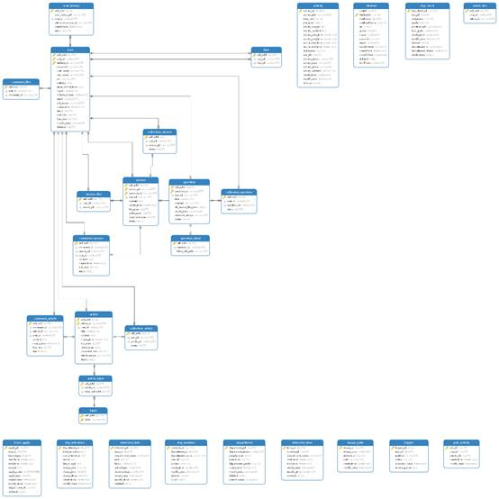
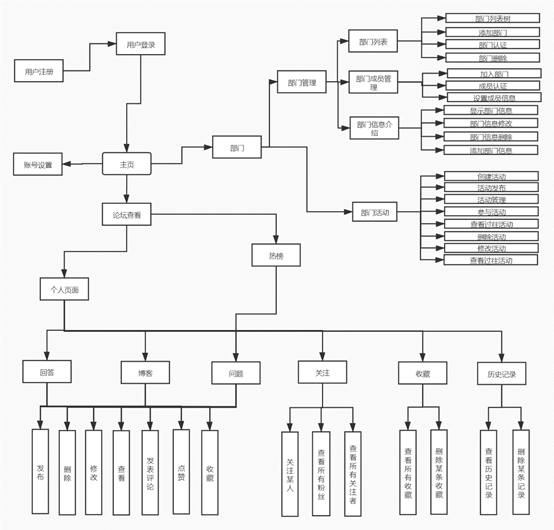
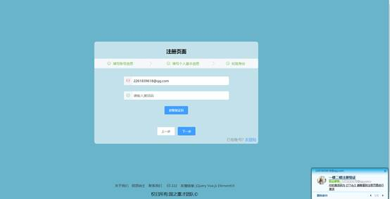
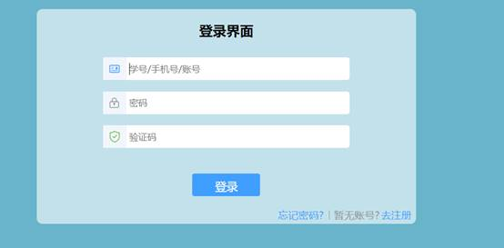
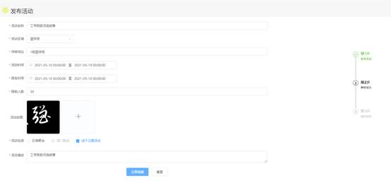
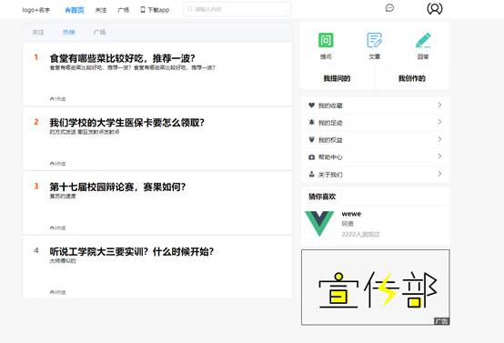
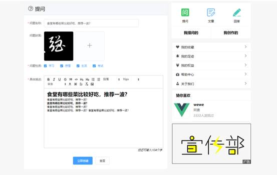
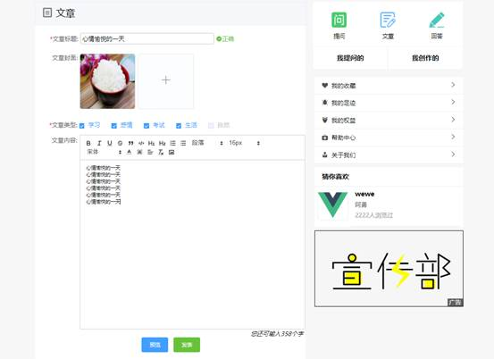
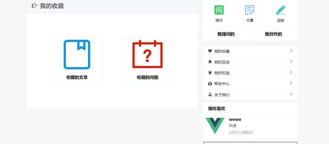
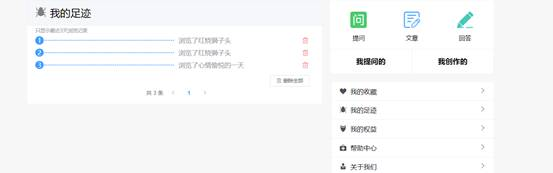

# 项目设计

## 功能：

该系统分为三个模块：用户模块、部门模块、论坛模块

用户模块实现了注册、登录、权限校验功能

部门模块实现了招新信息、部门活动的发布、修改、删除、查看功能，实现了人事管理功能。

论坛模块实现了提问、回答、博客、评论的发布、修改、删除、查看、点赞功能。

## 数据库设计：

## 程序流程图：

# 实现技术：

## 框架：

 SpringBoot、Mybatis

## 技术亮点：

Redis、AOP、JWT、Base64 加密、Swagger、Git

1：使用redis实现缓存，对可能会有高并发的数据进行缓存处理，提高访问效率

2：使用AOP实现日志记录，将每一条访问日志都进行记录

3：使用JWT实现前后端交互，JWT提供了比cookie、session更高的安全性

4：使用Base64 对用户密码进行加密，提高了数据安全性

5：使用swagger进行接口管理，提高开发效率

6：使用Git进行版本管理，提升团队配合效率

# 作品效果：

## 一：注册与登录

1：注册

需要填写个人信息，并且需要使用邮箱获取激活码

2：登录

填写学号与密码即可登陆（Ps：这里的验证码可以随意填写）。

## 二：部门

1：发布部门活动

填写相关活动信息，可以发布活动信息。

2：看部门活动

在这里可以查看全校所有的公开的部门活动，并且可以点击报名申请

## 三：微社区

1：热榜

热榜显示的是三天之内的问题，这些问题将按照其下所有回答的点赞总数进行排行，点赞总数高者将排名靠前，且热榜最多显示五十条数据。

2：提问

在填写提问信息之后，可以发布问题。该问题会在【我的提问】中进行查看。提问者可以对问题进行“修改、删除”操作。若三天内该问题下所有回答的点赞数超过了【热榜】中的问题，则该问题将被推荐至首页热榜。

3：回答

在问题详情页面，用户可以给问题提交回答。该问题下的所有回答会按照点赞数进行排行。同时，用户可以对自己发表的回答进行“修改、删除”操作。

4：文章

用户可以在【文章】中发布自己的图文作品，发布的文字可以在【我的创作】中进行查看。用户可以在【我的创作】中对已经发布的文章进行“修改、删除”操作。

5：点赞与收藏

用户可以对自己喜欢的问题、回答、文章进行点赞、收藏操作。被收藏的文章与问题可以在【我的收藏】中进行查看

6：历史记录

在【我的足迹】中可以查看到最近三天，自己浏览过的所有文章，并且用户可以对该浏览记录进行删除操作。

 

 

 